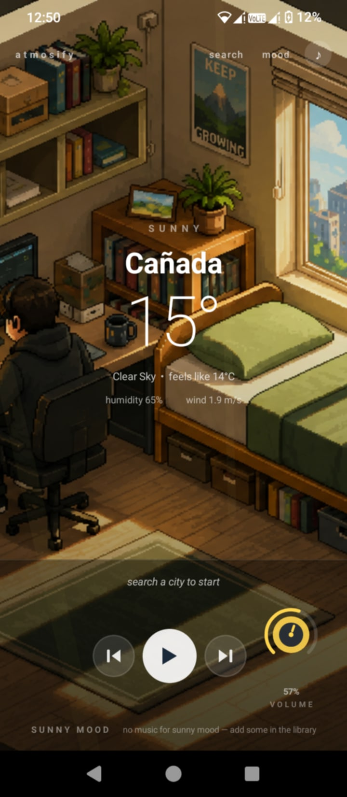
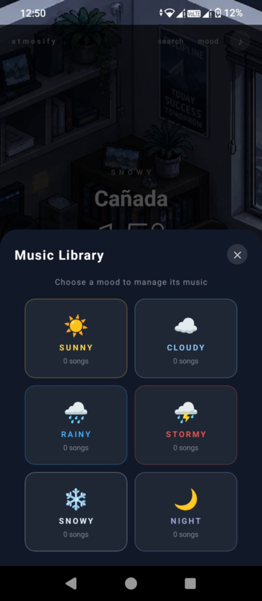
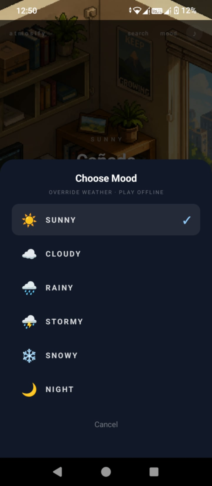

<div align="center">

# 🌤️ Atmosify

**Weather-driven music player for Android**

*The weather sets the mood. The mood sets the music.*

[](https://expo.dev)
[](https://reactnative.dev)
[](https://android.com)
[](LICENSE)

</div>

---

## 📸 Preview

<div align="center">



</div>

---

## ✨ Features

- 🌦️ **Live weather detection** — search any city and get real-time weather via OpenWeatherMap
- 🎵 **Mood-based playlists** — 6 moods: Sunny, Cloudy, Rainy, Stormy, Snowy, Night
- 🌙 **Auto night mode** — switches to Night mood between 7PM–6AM at the searched city's local time
- 📱 **Plays with screen off** — foreground service keeps music running like Spotify
- 🔔 **Media notification** — song name + mood label + prev/play/skip controls on lock screen
- 🎛️ **Volume knob** — drag up/down to adjust, syncs with phone volume buttons
- 💾 **Local music** — add your own MP3s from phone storage, organized per mood
- 🎨 **Pixel art backgrounds** — unique hand-made scene for each weather mood

---

## 🌈 Moods

| Mood | Weather | Time |
|------|---------|------|
| ☀️ Sunny | Clear sky | Day |
| ☁️ Cloudy | Clouds, Mist, Fog | Day |
| 🌧️ Rainy | Rain, Drizzle | Day |
| ⛈️ Stormy | Thunderstorm | Day |
| ❄️ Snowy | Snow | Day |
| 🌙 Night | Any weather | 7PM – 6AM |

---

## 🚀 Getting Started

### Prerequisites
- [Node.js](https://nodejs.org) v18+
- [Expo CLI](https://docs.expo.dev/get-started/installation/)
- [EAS CLI](https://docs.expo.dev/build/setup/) for building APK
- An [OpenWeatherMap](https://home.openweathermap.org) API key (free)

### Installation

```bash
git clone https://github.com/yourusername/atmosify.git
cd atmosify
npm install
npx expo install react-native-svg
```

### Add your API key

Open `src/services/weatherService.js` and replace:
```js
export const OWM_API_KEY = 'YOUR_API_KEY_HERE';
```

### Build APK

```bash
npm install -g eas-cli
eas login
eas init
eas build --platform android --profile preview
```

---

## 📁 Project Structure

```
atmosify/
├── App.js
├── app.json
├── eas.json
├── assets/
│   ├── backgrounds/          ← 6 pixel art mood backgrounds (1280×720)
│   │   ├── sunny.png
│   │   ├── cloudy.png
│   │   ├── rainy.png
│   │   ├── stormy.png
│   │   ├── snowy.png
│   │   └── night.png
│   ├── icon.png              ← App icon (1024×1024)
│   ├── splash.png            ← Splash screen
│   └── adaptive-icon.png     ← Android adaptive icon
└── src/
    ├── screens/
    │   └── MainScreen.js     ← Main UI
    ├── components/
    │   ├── VolumeKnob.js     ← Circular drag knob
    │   ├── LightRays.js      ← Animated light rays
    │   └── PlaylistManager.js← Music library modal
    └── services/
        ├── weatherService.js ← OpenWeatherMap API
        ├── musicStorage.js   ← AsyncStorage playlists
        └── audioService.js   ← Expo AV + notifications
```

---

## 🎵 Adding Music

1. Open Atmosify on your phone
2. Tap the **♪** button (top right)
3. Pick a mood (Sunny, Cloudy, Rainy...)
4. Tap **+ Add MP3 Files**
5. Select MP3s from your phone storage

Songs are saved per mood and shuffle automatically when the weather matches.

---

## 🛠️ Tech Stack

- [Expo](https://expo.dev) ~51
- [React Native](https://reactnative.dev) 0.74
- [expo-av](https://docs.expo.dev/versions/latest/sdk/av/) — audio playback
- [expo-notifications](https://docs.expo.dev/versions/latest/sdk/notifications/) — media notification
- [expo-document-picker](https://docs.expo.dev/versions/latest/sdk/document-picker/) — local MP3 import
- [react-native-svg](https://github.com/software-mansion/react-native-svg) — volume knob
- [AsyncStorage](https://react-native-async-storage.github.io/async-storage/) — playlist persistence

---

## 📄 License

MIT © 2025 — feel free to use, modify, and share.

---

<div align="center">
Made with ☁️ and music
</div>
